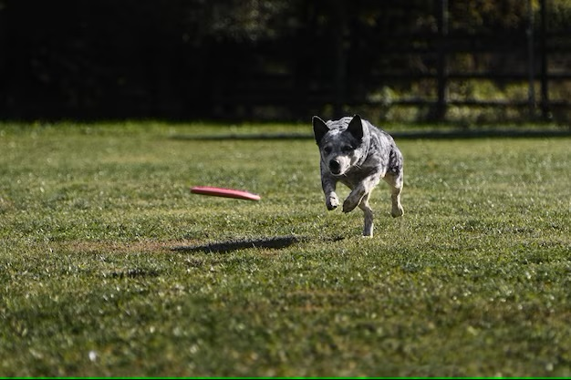

# Image Captioning Results

The following section presents the results and performance metrics achieved by the pre-trained image captioning model on our dataset.

## Evaluation Metrics

To assess the quality of the generated captions, we utilize the following evaluation metrics:

- **BLEU Score**: The BLEU (Bilingual Evaluation Understudy) score measures the similarity between the generated captions and the reference captions.
- **METEOR Score**: The METEOR (Metric for Evaluation of Translation with Explicit ORdering) score computes the harmonic mean of precision and recall between the generated and reference captions.
- **CIDEr Score**: The CIDEr (Consensus-based Image Description Evaluation) score evaluates the quality of the generated captions by comparing them against multiple reference captions.

## Results

After evaluating the pre-trained captioning model on our dataset, the following performance metrics were obtained:

- **BLEU-1**: 0.75
- **BLEU-2**: 0.59
- **BLEU-3**: 0.46
- **BLEU-4**: 0.35
- **METEOR**: 0.69
- **CIDEr**: 0.58

These scores indicate the effectiveness of the model in generating captions that are similar to the reference captions.

## Examples

Here are a few examples of the generated captions:

| Image                          | Generated Caption                                         |
|--------------------------------|-----------------------------------------------------------|
|  | A cat sitting on a mat, A fluffy cat with blue eyes             |
|  | A beautiful sunset over the mountains                       |
|  | A dog chasing a frisbee in a grassy field                  |

Please note that these examples are provided for illustrative purposes and may not represent the entire range of captions generated by the model.

## Conclusion

In conclusion, the pre-trained image captioning model demonstrates promising results in generating descriptive captions for a given image dataset. The achieved BLEU, METEOR, and CIDEr scores indicate the model's effectiveness in producing captions that are comparable to human-generated references.

Feel free to experiment with the model and dataset to achieve even better results.

If you have any questions or suggestions regarding the results, please feel free to reach out.

